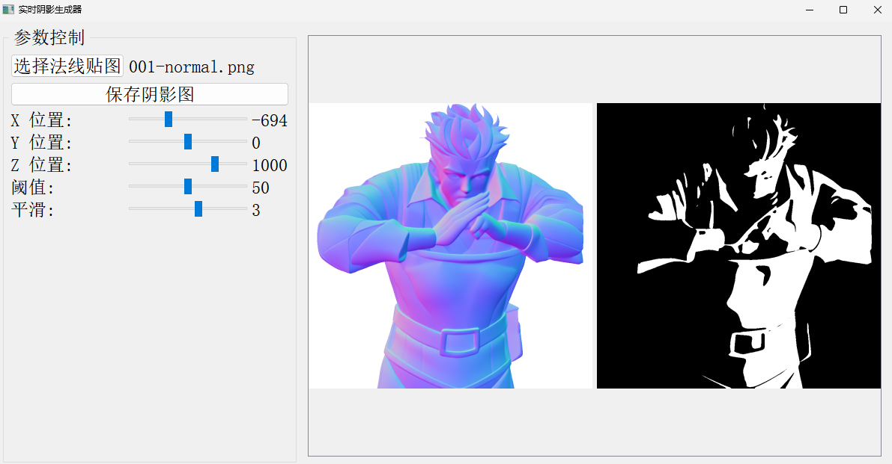

# Real-time Shadow Generator

A PyQt5-based application that generates real-time shadows from normal maps according to light position.

## Features

- Load normal maps in common image formats (PNG, JPG, JPEG, BMP)
- Adjust light position in 3D space using sliders
- Control shadow threshold and smoothing parameters
- Real-time preview of both normal map and generated shadow
- Save generated shadows as image files

## Requirements

- Python 3.6+
- NumPy >= 1.19.0
- OpenCV >= 4.5.0
- Pillow >= 8.0.0
- PyQt5 >= 5.15.0

## Installation

1. Clone this repository
2. Install dependencies:

## UI

